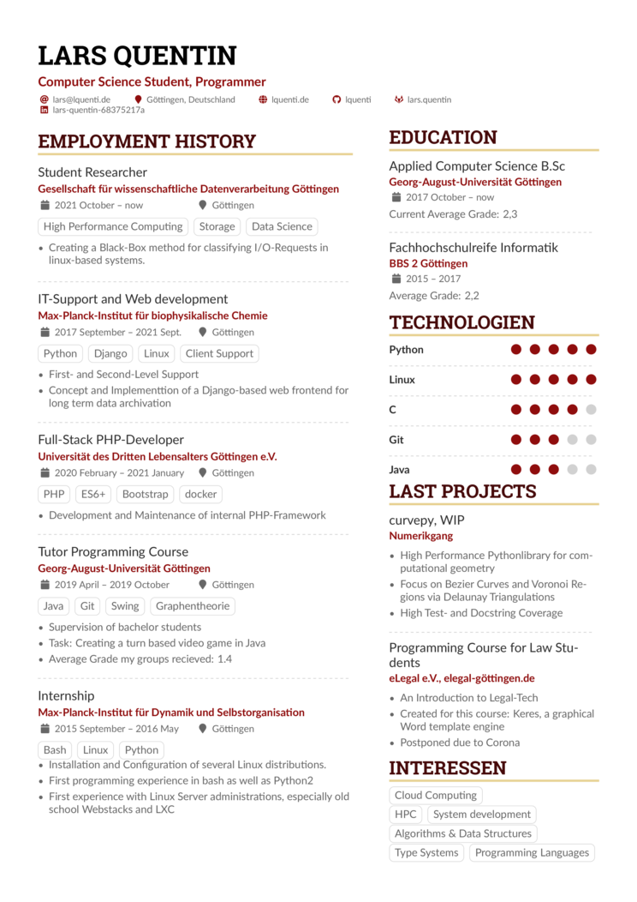

# My current CV

[MY CV](./cv.pdf)

Initally based on [AltaCV, v1.3.3](https://github.com/liantze/AltaCV)

# License

AltaCV is made by LianTze Lim (liantze@gmail.com), licensed under LPPL, see [LICENSE.md](./LICENSE.md)
I'll keep it that way, yeah whatever have fun, give her some clout if you fork it
